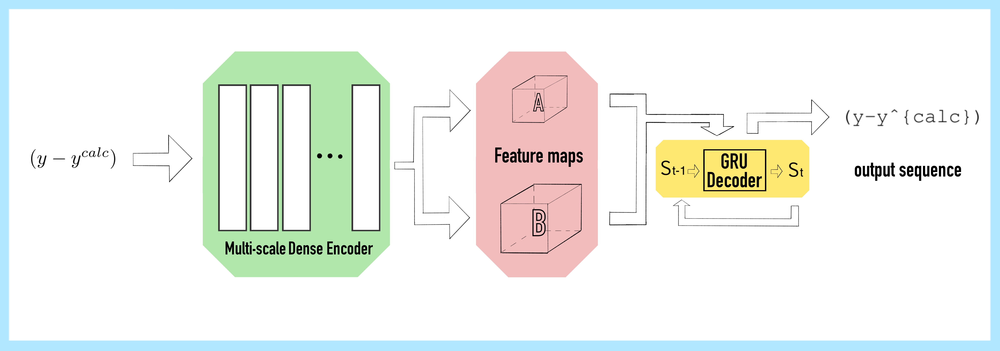

# About me

Hello! My name is Zhiyi Wang, and I am a 1st year master's student at ShanghaiTech
University. My area of expertise lies in Computer Vision and Computer Graphics.
I'm familar with contemporary Deep Learning frameworks such as MLP, CNN, RNN,
AE, GAN, NeRF, Diffusion, and LLM related stuff, alongside rendering techniques
like rasterization and surface/volume rendering. Currently, I am conducting
research at [SooLab lab](https://faculty.sist.shanghaitech.edu.cn/yangsibei/),
under the guidance of Prof. Sibei Yang.
You can download my resume [here](./assets/resume_en.pdf).

# Projects

### Pixmath | Nov. 2022 --- Jan. 2023

A math formula recognizer designed as the final project of Deep Learning (CS280)

- Aiming to recognize math formulas in images rendered by LaTeX engine back to LaTeX code.
- Used a CNN-GRU pipeline with attention mechanism.
- Capable of attaining a 25% accuracy rate and a word error rate (WER) of 25% on the CROHME 2013 test set.
- Yields credible recognition outcomes for inline cases, although performance may be constrained by limited GPU resources.

### Realistic Smoke Rendering | Dec. 2022 --- Jan. 2023

A renderer supports both surface and volume rendering
designed as the final project of Computer Graphics (CS171)

- Implemented basic Monte-Carlo *Path-Tracing* for surface rendering.
- Implemented sampler with *Delta-Tracking* and transmittance estimation with *Ratio-Tracking*, in addition to their integration with surface rendering.

